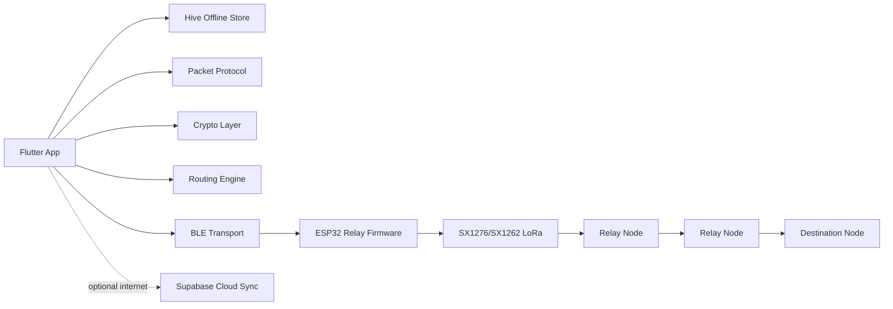
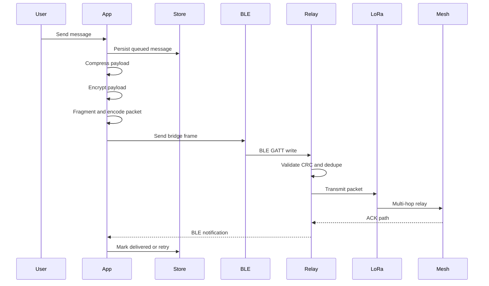

# MeshWave

**Offline-first decentralized communication over LoRa, Bluetooth LE, and self-healing mesh networking.**

MeshWave is a production-grade communication platform designed for environments where internet and cellular networks are unavailable, unreliable, or compromised. It combines a Flutter mobile app, ESP32 LoRa relay firmware, secure packet protocols, local-first storage, optional cloud sync, and a modular mesh routing engine.

The project is built as a serious portfolio-grade systems product: distributed networking, embedded systems, mobile architecture, cryptography, offline persistence, diagnostics, and emergency communication in one cohesive codebase.

> Current status: software-core verified, hardware-ready, and demoable without LoRa hardware through the included simulated mesh transport.

## Why MeshWave Exists

When infrastructure fails, communication should not fail with it.

MeshWave is designed for:

- disaster response teams
- search and rescue operations
- remote expeditions
- field engineering teams
- off-grid communities
- tactical coordination
- infrastructure monitoring
- emergency broadcast networks

The system is offline-first by design. Cloud services are optional and used only when internet is available.

## Demo Without Hardware

You can run the Flutter app without ESP32 or LoRa hardware.

The app includes a simulated mesh transport that lets you demonstrate:

- premium dashboard UI
- live mesh topology visualization
- chat flow
- emergency broadcast mode
- signal analytics
- relay monitor
- battery diagnostics
- device setup flow
- firmware update architecture
- notification center
- settings and profile screens

This is useful for interviews, demos, and architecture reviews before field-testing the hardware path.

## Hardware Mode

For real offline communication, MeshWave is designed for:

- ESP32 development board
- SX1276 or SX1262 LoRa radio module
- Bluetooth LE phone connection
- correct regional LoRa antenna
- battery or portable power system

The phone communicates with the ESP32 over BLE. The ESP32 bridges encrypted MeshWave packets onto LoRa, relays packets across nearby nodes, sends diagnostics back to the phone, and participates in heartbeat-based mesh routing.

## Monorepo Layout

```text
MeshWave/
  apps/
    mobile/                     Flutter mobile app
      lib/
        app/                    Router, app shell, providers
        core/
          crypto/               Identity, session encryption, replay guard
          database/             Hive local persistence contracts
          network/              BLE, simulated transport, sync service
          protocol/             Packet codec, CRC, ACK, fragmentation
          routing/              Mesh nodes, routes, relay policy
          telemetry/            Diagnostics ingestion
        features/
          auth/                 Secure pairing flow
          chat/                 Direct and emergency messaging
          dashboard/            Home command console
          devices/              BLE/device/firmware/battery screens
          emergency/            SOS and disaster mode
          mesh/                 Topology, analytics, relay monitor
          notifications/        Operational feed
          onboarding/           Splash and onboarding
          settings/             Profile, security, app settings
        shared/                 Theme and reusable premium widgets
      test/                     Protocol and routing tests

  firmware/
    esp32-lora/                 PlatformIO ESP32 firmware
      include/                  Config, packet protocol, router headers
      src/                      LoRa/BLE relay implementation

  backend/
    supabase/                   Optional cloud hybrid layer
      migrations/               PostgreSQL schema and RLS policies
      functions/                Edge functions

  docs/                         Architecture, protocol, deployment, hardware guides
  .github/workflows/            CI pipeline
  tools/                        Field readiness checklist
```

## Core Features

### Mobile App

- Flutter app with Material 3
- Riverpod state management
- GoRouter navigation
- Hive offline storage
- premium dark/light UI system
- animated topology visualization
- dashboard, chat, emergency, analytics, firmware, battery, relay, settings, profile, and notification screens
- simulated transport for hardware-free demos
- BLE transport abstraction for real relay hardware

### Mesh Networking

- node discovery model
- heartbeat synchronization
- route cache with expiry
- Dijkstra shortest-path routing
- adaptive relay ranking
- TTL-based packet forwarding
- relay battery protection
- emergency-priority relay override
- deduplication cache
- store-and-forward messaging

### Packet Protocol

- binary packet encoding/decoding
- CRC-16/CCITT-FALSE validation
- ACK/NACK-ready packet model
- packet TTL
- hop count
- source/destination/previous-hop/next-hop metadata
- fragmentation and reassembly
- replay-resistant sequence model
- payload size enforcement for LoRa constraints

### Security

- local cryptographic identity generation
- QR-ready public identity payload
- X25519 shared secret agreement
- AES-256-GCM encrypted envelopes
- HKDF-SHA256 key derivation
- Ed25519 signing key structure
- replay guard
- encrypted payload storage design

### Firmware

- ESP32 PlatformIO project
- SX1276/SX1262 LoRa configuration
- BLE GATT service
- phone-to-relay TX characteristic
- relay-to-phone RX notification characteristic
- LoRa packet receive/transmit loop
- packet CRC validation
- ACK generation
- heartbeat broadcast
- relay queue
- node health tracking
- diagnostics streaming to app

### Optional Cloud Hybrid

Supabase is included for online-only enhancement:

- PostgreSQL schema
- RLS policy foundation
- encrypted payload records
- diagnostics table
- route history
- relay history
- firmware version records
- emergency events
- Edge Function relay digest

Cloud is not required for offline operation.

## Architecture



## Packet Lifecycle



## Database Design

The repository includes schemas for:

- users
- devices
- messages
- routes
- nodes
- relay history
- emergency events
- encrypted payloads
- diagnostics
- firmware versions

See:

```text
backend/supabase/migrations/0001_initial_schema.sql
```

## Getting Started

### Prerequisites

For mobile:

- Flutter stable
- Dart SDK
- Android Studio or Xcode if building for device

For firmware:

- PlatformIO
- ESP32 board
- SX1276/SX1262 LoRa module

For optional cloud:

- Supabase CLI
- Supabase project

## Run the Mobile App

```powershell
cd C:\tmp\MeshWave\apps\mobile
flutter pub get
dart run build_runner build --delete-conflicting-outputs
flutter run
```

If Flutter tooling is locked or slow:

```powershell
flutter doctor -v
```

## Run Tests

```powershell
cd C:\tmp\MeshWave\apps\mobile
dart analyze lib test
dart test test\protocol_test.dart test\route_engine_test.dart
```

Verified in this repo:

- dependency resolution
- code generation
- formatting
- static analysis
- protocol tests
- routing tests

## Build Firmware

Install PlatformIO, then:

```powershell
cd C:\tmp\MeshWave\firmware\esp32-lora
pio run
pio run -t upload
pio device monitor
```

Before transmitting, confirm your LoRa frequency, spreading factor, bandwidth, antenna, and transmit power are legal in your region.

## Optional Supabase Setup

```powershell
cd C:\tmp\MeshWave\backend\supabase
supabase start
supabase db reset
supabase functions serve relay-digest
```

## Important Code Paths

| Area | File |
| --- | --- |
| App entry | `apps/mobile/lib/main.dart` |
| Router | `apps/mobile/lib/app/router.dart` |
| Runtime providers | `apps/mobile/lib/app/providers.dart` |
| Packet codec | `apps/mobile/lib/core/protocol/packet_codec.dart` |
| CRC validation | `apps/mobile/lib/core/protocol/crc16.dart` |
| Fragmentation | `apps/mobile/lib/core/protocol/fragmenter.dart` |
| ACK retry | `apps/mobile/lib/core/protocol/ack_tracker.dart` |
| Routing engine | `apps/mobile/lib/core/routing/route_engine.dart` |
| Relay policy | `apps/mobile/lib/core/routing/relay_policy.dart` |
| Encryption | `apps/mobile/lib/core/crypto/session_cipher.dart` |
| Identity | `apps/mobile/lib/core/crypto/secure_identity.dart` |
| BLE transport | `apps/mobile/lib/core/network/ble_mesh_transport.dart` |
| Simulated transport | `apps/mobile/lib/core/network/simulated_mesh_transport.dart` |
| Firmware main loop | `firmware/esp32-lora/src/main.cpp` |
| Firmware packet codec | `firmware/esp32-lora/src/packet_protocol.cpp` |
| Supabase schema | `backend/supabase/migrations/0001_initial_schema.sql` |

## Interview Demo Script

If showing this without hardware, say:

> MeshWave runs today with a simulated mesh transport so the full product experience can be demonstrated without radio hardware. The app architecture is hardware-ready: BLE transport, ESP32 firmware, packet codec, CRC validation, routing engine, local persistence, emergency mode, and optional Supabase sync are implemented as separate modules. The next validation phase is hardware-in-loop testing with ESP32 and SX1276/SX1262 LoRa nodes.

Demo flow:

1. Open the app.
2. Show onboarding and secure pairing.
3. Show dashboard and simulated network health.
4. Open mesh topology.
5. Send a field chat message.
6. Trigger emergency broadcast.
7. Show signal analytics and relay monitor.
8. Open firmware and battery diagnostics.
9. Walk through packet codec, route engine, and firmware code.

## Documentation

```text
docs/architecture.md
docs/protocol.md
docs/hardware_wiring.md
docs/firmware_flashing.md
docs/deployment.md
docs/api.md
docs/troubleshooting.md
docs/diagrams/
```

## Production Notes

MeshWave is designed as a production-grade foundation, but real-world radio systems require field validation.

Before life-safety use:

- complete hardware-in-loop testing
- validate LoRa performance in your terrain
- tune regional radio settings
- perform security review
- audit cryptographic protocol choices
- add formal OTA signing and rollback enforcement
- complete regulatory compliance review
- test battery behavior under real duty cycles

## Current Verification

The software core has been verified with:

```powershell
dart pub get
dart run build_runner build --delete-conflicting-outputs
dart format lib test
dart analyze lib test
dart test test\protocol_test.dart test\route_engine_test.dart
```

PlatformIO firmware build is configured in CI and should be run locally once PlatformIO is installed.

## License

MIT License.

## Project Status

MeshWave is a complete, modular, interview-ready offline communication platform foundation. It is suitable for portfolio demonstration, architecture discussion, and continued development into a field-tested LoRa mesh product.
