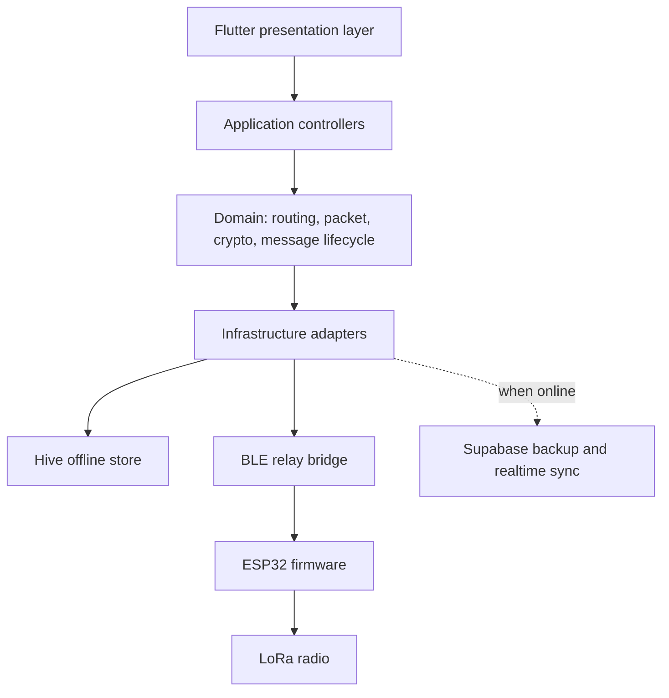

# MeshWave Architecture

MeshWave is a local-first mesh communication system. Every layer assumes internet is absent, slow, or hostile.

## Layers

## Mobile App

- Riverpod owns long-lived services and runtime state.
- GoRouter keeps every production screen addressable.
- Hive stores conversations, messages, nodes, diagnostics, encrypted payload metadata, and queue state.
- Protocol, routing, and crypto modules are isolated under `lib/core`.
- Feature folders own UI and interaction flow.

## Firmware

- ESP32 exposes a BLE GATT service to the phone.
- The phone writes encoded MeshWave packet frames to the TX characteristic.
- Firmware validates, queues, relays, ACKs, and broadcasts LoRa frames.
- Firmware sends received LoRa packets and diagnostics back to the phone through notifications.

## Cloud Hybrid

Supabase is optional. It provides:

- Authenticated backups.
- Fleet diagnostics.
- Firmware release metadata.
- Realtime dashboards when internet is available.

The cloud never needs plaintext message content. Store encrypted payloads only.

## Failure Model

| Failure | Response |
| --- | --- |
| Internet unavailable | App remains fully usable with Hive, BLE, and LoRa. |
| Direct LoRa path weak | Routing engine selects relay hops by link cost. |
| Node disappears | Heartbeat expiry invalidates route cache. |
| Duplicate packet | Dedupe cache drops repeated sequence fragments. |
| ACK missing | Exponential backoff schedules retransmission. |
| Battery low | Relay policy preserves reserve except emergency priority. |

## Security Boundaries

- Private keys never leave the mobile device.
- Pairing QR contains public identity only.
- LoRa firmware sees routing metadata and opaque encrypted payloads.
- AES-256-GCM envelopes include algorithm, nonce, MAC, and associated data.
- Replay guard rejects repeated and stale sequences per peer.

For real public deployment, complete an external security audit and consider Double Ratchet or MLS for group sessions.
