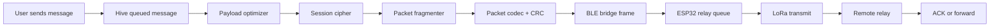

# Communication Flow

```mermaid
flowchart LR
  A["User sends message"] --> B["Hive queued message"]
  B --> C["Payload optimizer"]
  C --> D["Session cipher"]
  D --> E["Packet fragmenter"]
  E --> F["Packet codec + CRC"]
  F --> G["BLE bridge frame"]
  G --> H["ESP32 relay queue"]
  H --> I["LoRa transmit"]
  I --> J["Remote relay"]
  J --> K["ACK or forward"]
```
