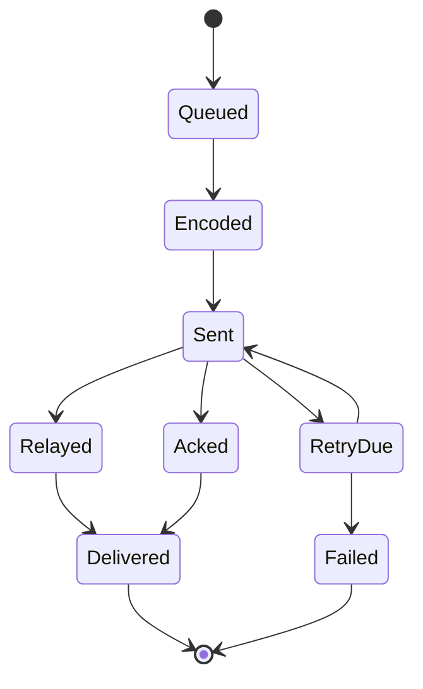

# Packet Lifecycle

```mermaid
stateDiagram-v2
  [*] --> Queued
  Queued --> Encoded
  Encoded --> Sent
  Sent --> Acked
  Sent --> RetryDue
  RetryDue --> Sent
  Sent --> Relayed
  Relayed --> Delivered
  RetryDue --> Failed
  Acked --> Delivered
  Delivered --> [*]
  Failed --> [*]
```
