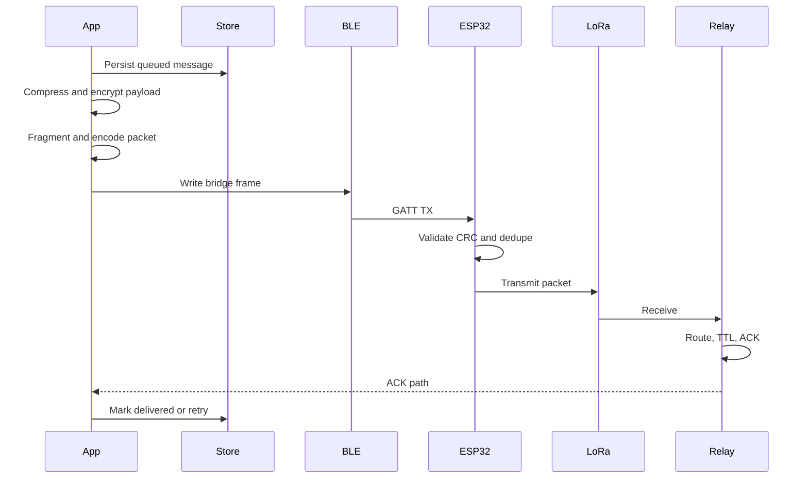

# Packet Protocol

MeshWave uses a compact binary frame with deterministic big-endian encoding. The same layout is implemented in Flutter and ESP32 firmware.

## Frame Layout

| Field | Bytes | Notes |
| --- | ---: | --- |
| Magic | 2 | `0x4d57` (`MW`) |
| Version | 1 | Current: `1` |
| Kind | 1 | data, ack, nack, heartbeat, route advert, emergency, diagnostics, pairing |
| Flags | 1 | ack, encrypted, fragmented, broadcast |
| Priority | 1 | background, normal, high, emergency |
| TTL | 1 | decremented at every relay |
| Hop count | 1 | incremented at every relay |
| Fragment index | 2 | zero-based |
| Fragment count | 2 | total fragments |
| Sequence | 4 | sender sequence |
| Created at | 8 | milliseconds |
| Source length | 1 | UTF-8 node id length |
| Destination length | 1 | UTF-8 node id length |
| Previous hop length | 1 | UTF-8 node id length |
| Next hop length | 1 | UTF-8 node id length |
| Payload length | 2 | LoRa payload bytes |
| Reserved | 2 | future protocol extensions |
| Node ids | variable | source, destination, previous, next |
| Payload | variable | encrypted or control payload |
| CRC16 | 2 | CCITT-FALSE over all preceding bytes |

## Lifecycle



## ACK/NACK

- Data and emergency packets require ACK by default.
- ACK payload includes the acknowledged sequence.
- NACK can be used for corrupt fragment or route failure reporting.
- Retry backoff starts at two seconds and caps attempts to protect airtime.

## Fragmentation

Encrypted payloads above the LoRa frame budget are split into fragments. Reassembly keys use:

```text
source:destination:sequence
```

Fragments expire from memory after a bounded time window.

## Adaptive Routing Metadata

Nodes share heartbeat and diagnostics data:

- RSSI
- SNR
- Battery percent
- Queue depth
- Firmware version
- Last seen time

The route engine converts these into link cost and relay ranking.
